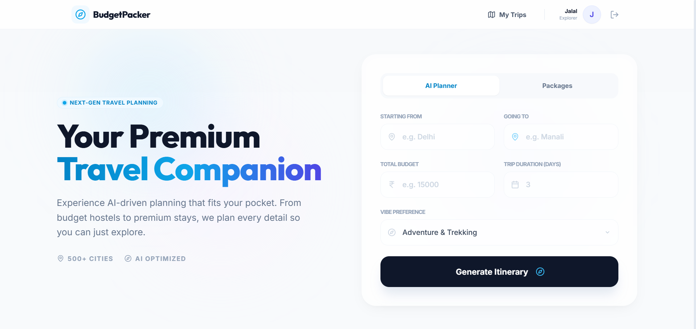
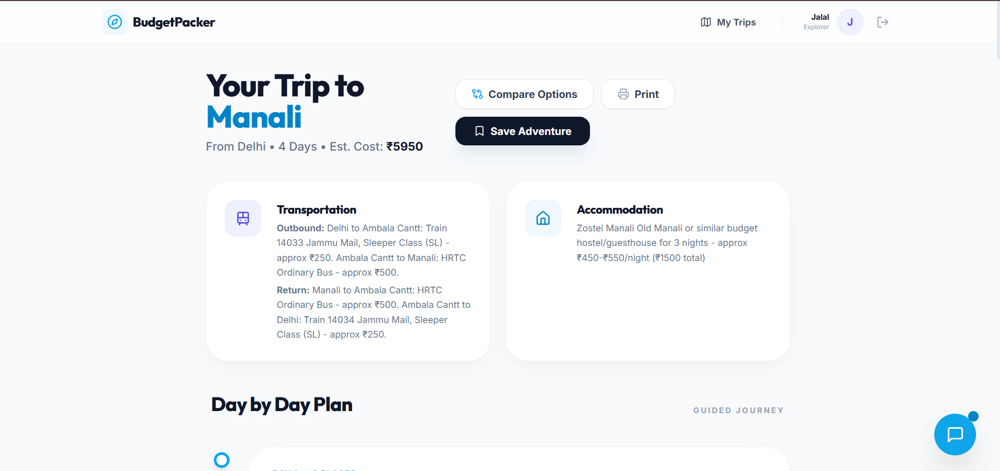
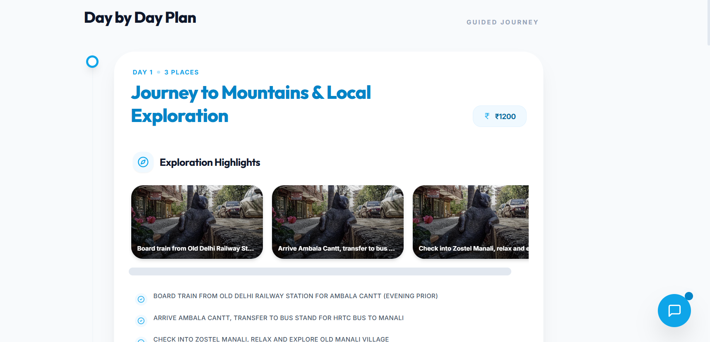
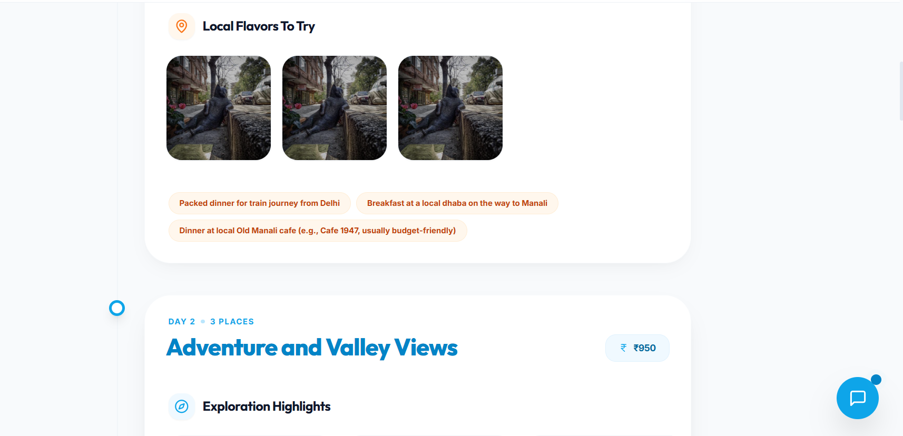
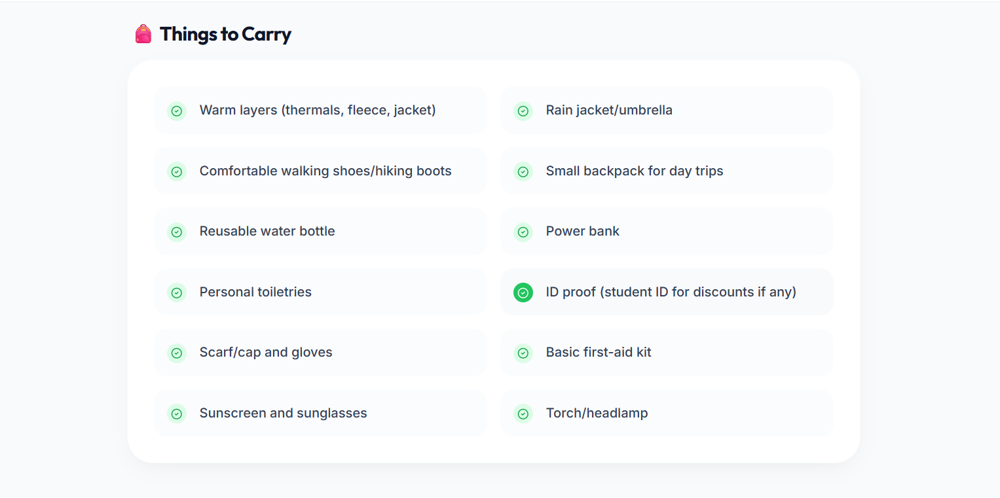
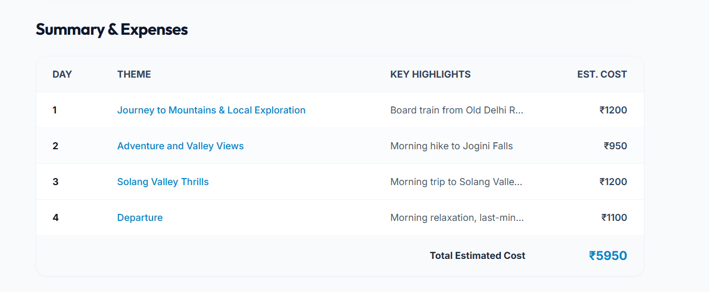
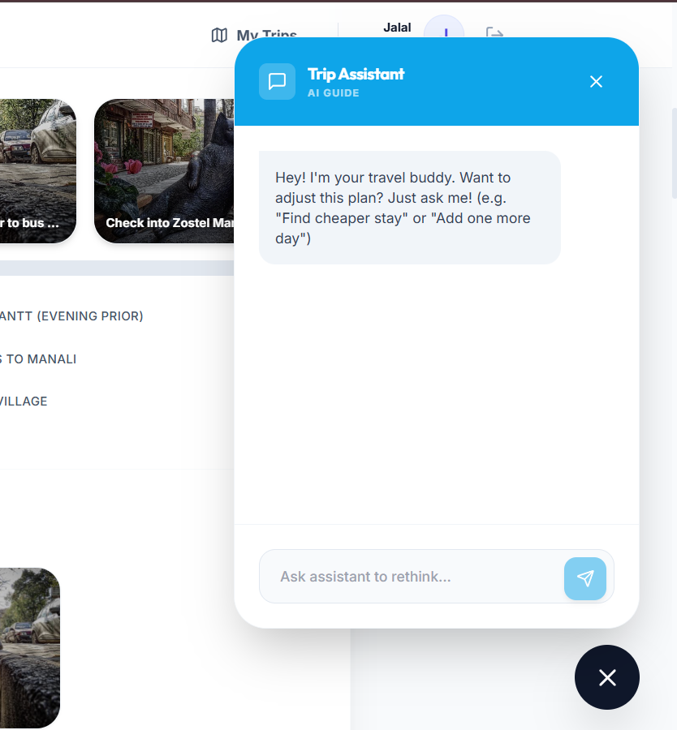
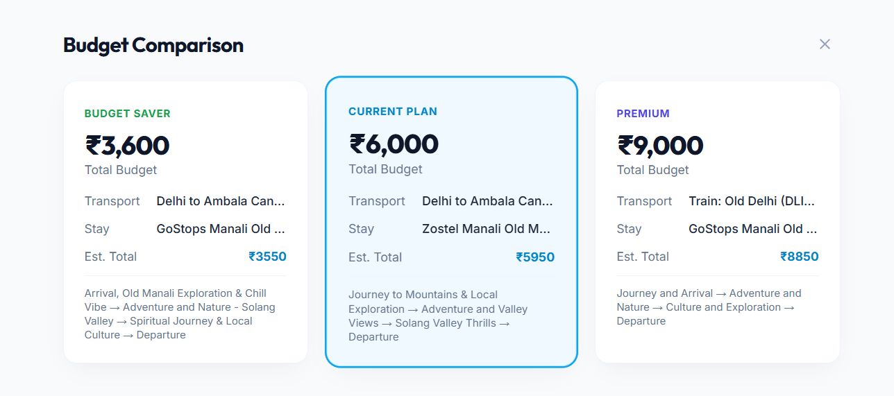
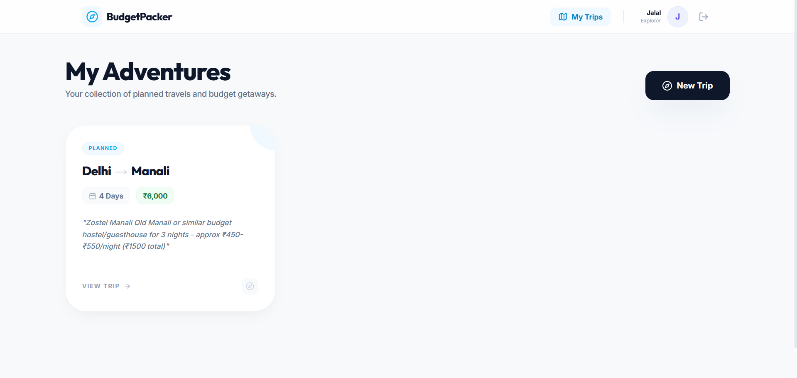

# 🎒 BudgetPacker – AI-Powered Trip Planner

A full-stack MERN application that uses Google Gemini AI to generate **budget-friendly travel itineraries** for students and backpackers in India.

---

## 📸 Project Preview

### 🏠 Landing Page



### 📝 Create Trip


### 🤖 AI Generated Itinerary







### 💬 AI Chat Planner



### 📊 Budget Comparison



### ❤️ Saved Trips



---

## 🚀 Features

* 🤖 **AI-Powered Itineraries** — Generates day-by-day plans with trains, hostels, and food spots
* 💬 **Conversational Planning** — Chat with AI to modify plans dynamically
* 📊 **Budget Comparison** — Compare multiple budget plans side-by-side
* 📦 **Curated Packages** — Pre-built travel packages with search functionality
* 🔐 **User Authentication** — Secure JWT-based login/register system
* 💾 **Saved Trips** — Save and revisit itineraries anytime
* 🖨️ **Offline Print** — Printable trip plans for offline access
* 🎒 **Smart Packing List** — AI-generated packing suggestions

---

## 🛠️ Tech Stack

| Layer     | Technology                              |
| --------- | --------------------------------------- |
| Frontend  | React, Vite, TailwindCSS, Framer Motion |
| Backend   | Node.js, Express.js                     |
| Database  | MongoDB (Mongoose)                      |
| AI Engine | Google Gemini 2.5 Flash                 |
| Auth      | JWT, bcryptjs                           |

---

## 📂 Project Structure

```
AI Trip/
├── backend/
│   ├── config/          
│   ├── middleware/      
│   ├── models/          
│   ├── routes/          
│   ├── services/        
│   ├── .env             
│   ├── package.json
│   └── server.js        
├── frontend/
│   ├── public/
│   ├── src/
│   │   ├── components/  
│   │   ├── context/     
│   │   ├── pages/       
│   │   ├── App.jsx      
│   │   ├── main.jsx     
│   │   └── index.css    
│   ├── package.json
│   └── tailwind.config.js
└── README.md
```

---

## ⚙️ Getting Started

### Prerequisites

* Node.js v18+
* MongoDB (local or Atlas)
* Google AI Studio API Key

---

### 🔧 Setup Instructions

#### 1. Clone the Repository

```bash
git clone https://github.com/your-username/budgetpacker.git
cd budgetpacker
```

#### 2. Backend Setup

```bash
cd backend
cp .env.example .env
npm install
npm run dev
```

#### 3. Frontend Setup

```bash
cd frontend
npm install
npm run dev
```

#### 4. Run the App

Open 👉 http://localhost:5173

---

## 🔐 Environment Variables

Create a `backend/.env` file:

```
PORT=5000
MONGODB_URI=your_mongodb_connection_string
GEMINI_API_KEY=your_google_ai_studio_key
JWT_SECRET=your_jwt_secret
```

---

## 🌟 Future Enhancements

* 🌍 Real-time booking integration (trains, buses, hotels)
* 📱 Mobile application (React Native)
* 🧠 Advanced recommendation engine (ML-based)
* 👥 Community-based trip sharing

---

## 🤝 Contributing

Contributions are welcome! Feel free to fork this repository and submit a pull request.

---

## 📧 Contact

**Jalal**
📩 Open for collaboration, feedback, and opportunities 🚀
